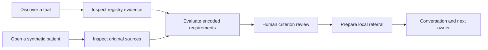

<div align="center">

# Trial Loop

### Finding a trial is the start. Closing the loop is the work.

**An evidence-linked workspace for oncology trial discovery, explainable pre-screening and referral coordination.**

[Explore the live demo](https://onco-grid-trial-loop-validation.vercel.app/#/) · [Run a worked case](https://onco-grid-trial-loop-validation.vercel.app/#/patients/SYN-001?section=matches&scope=selected&trial=NCT06348199) · [Run locally](#run-locally) · [The north star](#the-north-star)

</div>

---

A registry can tell you a study exists. A clinician still has to inspect its requirements, reconstruct the patient's evidence, resolve missing information, contact the appropriate team and keep the handoff moving.

**Trial Loop connects those steps without erasing the distinctions between them.**

What the source says. What the engine evaluated. What a clinician reviewed. Who owns the next response.

> **Current release: a working synthetic demonstration, not a clinical service.** Public registry data is real; patient examples are synthetic. Matching is deterministic and not clinically validated. Patient reviews and referrals live in browser memory, reset on reload and are not delivered between institutions. Do not enter real patient information.

## Two doors. One connected workflow.

**Trial-first:** explore a study, inspect its evidence and—where authenticated study access is configured—evaluate the synthetic candidate cohort.

**Patient-first:** inspect a synthetic record, assess encoded trial requirements, review the findings and prepare a version-bound referral.



The context survives the journey. A referral is attached to the assessment that was reviewed—not quietly rebuilt from whatever the record happens to say later.

## What you can explore today

| Capability | What is implemented | Boundary |
| --- | --- | --- |
| **Trial discovery** | Search and filter a bundled snapshot of 285 India-located oncology studies; open registry-linked details. | A dated ClinicalTrials.gov snapshot, not exhaustive coverage of Indian trials. |
| **Spatial discovery** | India and global geographic views, with study lists behind the locations. | Registry geography, not travel guidance, verified capacity or an underserved-region analysis. |
| **Evidence workspace** | Cancer coverage, Drug/Biological index, bounded global trial search, source-derived abstracts and publication metadata. | Institution cards are planning proxies, not connected or endorsed partners. |
| **Patient workspace** | Twelve synthetic records with original artifacts, grouped assertions, missing information and conflicting evidence. | No live EMR ingestion or automatic extraction from real medical documents. |
| **Explainable matching** | Six source-linked trial models; patient-to-trial and trial-to-patient evaluation use the same engine. | Unmodelled studies are explicitly unassessed. Findings are not eligibility decisions. |
| **Progressive review** | A criterion checklist, evidence links, individual decisions, explicit bulk acknowledgement of supported findings and review progress. | Human decisions remain separate from machine findings. |
| **Referral coordination** | Reviewed packet, shared-in-session thread, next owner, clarification, withdrawal and study-team transitions. | Browser-local simulation; no real patient transmission or cross-user delivery. |
| **PI access** | Study-scoped grants guard the PI workspace and its commands. | The prototype role selector is not authentication. Live service qualification remains open. |

## Take the three-minute tour

No account or API key is needed for the public patient-first demonstration.

1. **[Open Patients](https://onco-grid-trial-loop-validation.vercel.app/#/patients).** Choose **Complete lung record**: Patient 1 against study `NCT06348199`.
2. **Run reference case.** The supplied benchmark produces **6 of 6 encoded requirements supported**. Expand **Why this outcome** to inspect the reasoning.
3. **Open Review evidence.** If prompted, choose **Use oncologist demo role**. Inspect a criterion and its patient evidence; **View original** leads back to the source artifact.
4. **Record the review.** Use **Save review & continue**, or explicitly select supported findings to acknowledge together. Complete all six reviews.
5. **Prepare referral.** Inspect the attached findings and decisions, write a synthetic request, confirm the local-demo boundary and choose **Queue demo referral**.
6. **Follow the thread.** The referral becomes **Awaiting team**, with a named next owner. Find it again through the patient's Referrals tab or Inbox.

**Keep this journey in one tab without refreshing.** The public demo stops at awaiting a team response; it does not fabricate an investigator's acknowledgement. Study-team actions require configured authentication and an explicit study grant.

### Don't just try the happy path

The Patients page also includes:

| Worked case | What it exposes |
| --- | --- |
| **Complete breast record** | A second fully supported reference example. |
| **Documented exclusion** | A supplied fact conflicts with an encoded exclusion. |
| **Incomplete intake** | Missing and unreviewed assertions remain unresolved. |
| **Conflicting molecular evidence** | Opposing source assertions are not silently collapsed into a convenient answer. |

These are reproducible reference scenarios, not clinical benchmarks.

## Matching you can interrogate

The matching engine is **rules-based, not an LLM generating an eligibility opinion**. It evaluates explicit predicates against versioned synthetic assertions and retains a trace of the evidence used.

For each criterion, the result is:

- **Supported:** the supplied evidence supports the encoded requirement.
- **Violated:** the supplied evidence conflicts with the encoded requirement.
- **Unresolved:** the evidence or interpretation is insufficient to decide.
- **Not applicable:** an explicit applicability condition excludes the criterion from the assessment.

The support fraction is:

```text
supported / (supported + violated + unresolved)
```

It measures support for the **encoded requirements**, not a probability of eligibility, treatment benefit or acceptance by a site. Not-applicable criteria are excluded from the denominator. Review ordering puts assessable results first, then results without known violations, then support fraction and unresolved count; it is not a clinical recommendation ranking.

### Two run modes, two different promises

**Run reference case** evaluates the supplied, dated benchmark. Use it for a reproducible demonstration.

**Check live registry & match** first checks current public registry eligibility against the retained model source. Changed eligibility, unavailable detail or stale source evidence prevents a current score. Registry checks expire after 15 minutes; reconciling a changed protocol is not delegated to an automatic reinterpretation.

**A supported result does not mean a recruiting study. A recruiting study does not mean an available slot. Neither means a site has accepted a referral.**

### Changes invalidate decisions—not history

Assessments retain the patient assertions and model version used at evaluation. Human reviews sit alongside those findings. When relevant inputs change, old assessments become stale rather than silently changing meaning.

Stale referral assessments block queueing and screening-readiness recording. Clarification and withdrawal remain available. A replacement packet must belong to the same patient and study and have a complete, current review.

## The north star

**Vision—not shipped capabilities or institutional commitments.**

Trial Loop's ambition is a knowledge and collaboration network that connects **what is known, who can clarify it and what happens next**.

| Future capability | The ambition |
| --- | --- |
| **Living knowledge graph** | Connect cancers, biomarkers, drugs, protocols, publications, investigators and sites with provenance and update history. |
| **Verified trial-access network** | Let authorised sites publish current recruitment, screening availability and accountable contact routes. |
| **Institutional memory** | Turn reviewed, permissioned operational clarifications into reusable knowledge—without exposing patient conversations or treating one site's answer as a universal rule. |
| **Always-on trial radar** | With consent and clinical governance, revisit opportunities as records, protocols and recruitment change. |
| **Privacy-preserving recruitment** | Explore candidate availability across participating institutions without pooling identifiable records centrally. |
| **A genuinely closed loop** | Secure, consent-based referral exchange, acknowledgement, navigation and documented screening outcomes across institutions. |

Those steps require clinical qualification, institutional participation, approved data handling and real-world workflow evidence. They are the destination—not claims about the current demo.

## Why this problem is worth investigating

Selected sources from the research informing this project:

1. **[Landscape of cancer clinical trials in India](https://pmc.ncbi.nlm.nih.gov/articles/PMC11096683/) — 2023.** Analysis of 1,988 CTRI cancer trials from 2007–2021 reports geographic and cancer-type disparities and registry-data limitations. Supports discovery and provenance research; does not establish current site availability.
2. **[Tumour-board characteristics and functioning in NCRP-affiliated hospitals](https://pmc.ncbi.nlm.nih.gov/articles/PMC13161587/) — 2026.** Of 172 responding hospitals, 137 reported functioning boards; among those boards, 48.2% lacked a recommendation follow-up system. Evidence of a related coordination gap—not a trial-referral prevalence estimate.
3. **[National Cancer Grid initiative for electronic medical records, India](https://pmc.ncbi.nlm.nih.gov/articles/PMC12057217/) — 2025.** Describes Indian oncology workflow, retrieval and interoperability challenges, alongside substantial existing infrastructure. Trial Loop must complement that work, not pretend it does not exist.
4. **[Information needs of professionals caring for patients with cancer](https://pubmed.ncbi.nlm.nih.gov/27550233/) — 2016.** A German survey with 495 evaluable questionnaires supports the need for accessible, transparent information. Its findings are not an Indian workload estimate.
5. **[National Cancer Grid Virtual Tumor Board](https://www.ncgindia.org/key-initiatives/virtual-tumor-board).** An existing Indian model for structured cross-institution expert discussion. Programme description, not evidence of Trial Loop effectiveness or partnership.

These sources motivate the questions. They do **not** validate this product's matching accuracy, recruitment impact or clinical benefit.

